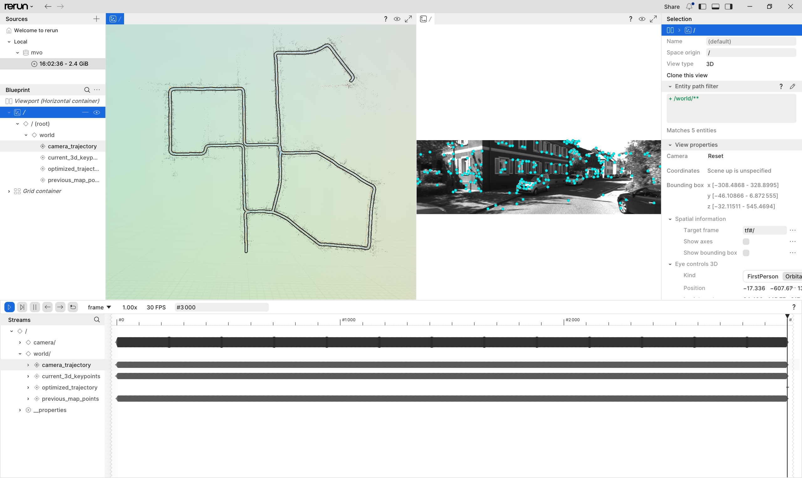

# SLAM from Scratch

Monocular visual odometry (MVO) built on hand-written solvers from my
`cvlib` library: custom PnP, RANSAC, triangulation, and bundle adjustment
(no g2o/Ceres), with KLT tracking, ORB-SLAM-style two-view initialization,
DBoW2 loop closure, and Rerun 3D visualization on KITTI.

Author: Hyunwoo Park <phphww93@gmail.com>

## Results

Monocular run on the KITTI 00 sequence with loop closure and bundle
adjustment, captured live from the Rerun viewer.


Left: the map builds up incrementally — camera trajectory, current-frame map
points, and accumulated historical map points. Right: the left camera image
with the active KLT tracks that feed PnP. Loop closure runs a Sim(3) pose
graph followed by a full BA and is logged as a separate optimized trajectory.



The recovered trajectory closes the large KITTI 00 loops, and the map point
cloud reproduces the street layout of the sequence.

## Quick Start

```powershell
.\build.ps1 # default: install all dependencies and build
.\run.ps1 -Config Release -MaxFrames 3 -NoBa -NoRerun -ParameterDir .\configs\parameters # quick run check
.\run.ps1 -Config Release # run with Rerun viewer
```

```bash
bash build.sh # default: install all dependencies and build
bash run.sh --config Release --max-frames 3 --no-ba --no-rerun --parameter-dir ./configs/parameters # quick run check
bash run.sh --config Release # run with Rerun viewer
```

## Quick Install

```powershell
.\build.ps1 # default: same as -InstallAll
.\build.ps1 -InstallAll # install OpenCV and Rerun, then build
.\build.ps1 -InstallOpenCV # install OpenCV, then build
.\build.ps1 -InstallRerun # install Rerun, then build
.\build.ps1 -NoInstall # build only with existing dependencies
$env:OpenCV_DIR = "$env:LOCALAPPDATA\rtk\opencv-4.13.0\opencv\build" # custom OpenCVConfig.cmake path
py -m pip install --user rerun-sdk==0.33.0 # manual Rerun install
$UserScripts = Join-Path (& py -c "import site; print(site.USER_BASE)") "Scripts" # Python user Scripts path
$env:PATH = "$UserScripts;$env:PATH" # add rerun.exe to PATH
```

```bash
bash build.sh # default: same as --install-all
bash build.sh --install-all # install OpenCV and Rerun, then build
bash build.sh --install-opencv # install OpenCV, then build
bash build.sh --install-rerun # install Rerun, then build
bash build.sh --no-install # build only with existing dependencies
export OpenCV_DIR="$LOCALAPPDATA/rtk/opencv-4.13.0/opencv/build" # custom OpenCVConfig.cmake path
python3 -m pip install --user rerun-sdk==0.33.0 # manual Rerun install
export PATH="$(python3 -c 'import site; print(site.USER_BASE)')/bin:$PATH" # add rerun to PATH on Linux/macOS
export PATH="$(cygpath -u "$APPDATA")/Python/Python314/Scripts:$PATH" # add rerun.exe to PATH on Git Bash
```

## Data

KITTI 00 grayscale images (`image/image_0`, 4541 frames) are not tracked in
git. `build.ps1`/`build.sh` and `run.ps1`/`run.sh` download and extract
`kitti00_image0.tar.gz` from the GitHub release `kitti00-data` automatically
when `image/image_0` is missing. Manual fetch: `.\fetch_data.ps1` or
`bash ./fetch_data.sh`; override the source with `MVO_DATA_URL`.
`image/calib.txt`, `image/GTpose.txt`, and the DBoW2 vocabulary stay in git.

## File Structure

```text
MVO/
  CMakeLists.txt
  build.ps1, build.sh
  run.ps1, run.sh
  fetch_data.ps1, fetch_data.sh
  bundle_cvlib.ps1, bundle_cvlib.sh
  docs/
    cvlib-update-analysis.md
    result.gif
    result.png
  configs/
    kitti_image_sequence.json
    parameters/
      feature.json
      pnp.json
      initializer.json
      mapping.json
      bundle_adjustment.json
      loop_closure.json
      visualization.json
  include/
    app.h
    bundle_adjustment.h
    config.h
    constants.h
    converter.h
    feature.h
    frame_source.h
    init.h
    loop_closure.h
    map_data.h
    parameters.h
    pose_estimation.h
    pose_graph.h
    types.h
    visualization.h
  src/
    app.cpp
    bundle_adjustment.cpp
    config.cpp
    converter.cpp
    cvlib_main.cpp
    feature.cpp
    frame_source.cpp
    init.cpp
    loop_closure.cpp
    map_data.cpp
    parameters.cpp
    pose_estimation.cpp
    pose_graph.cpp
    visualization.cpp
  thirdparty/
    cvlib/
    DBoW2/
```
